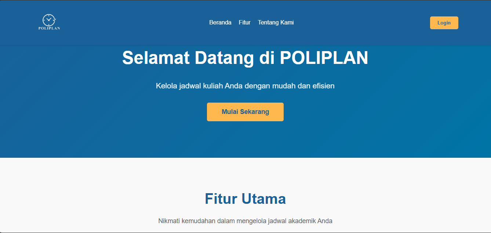
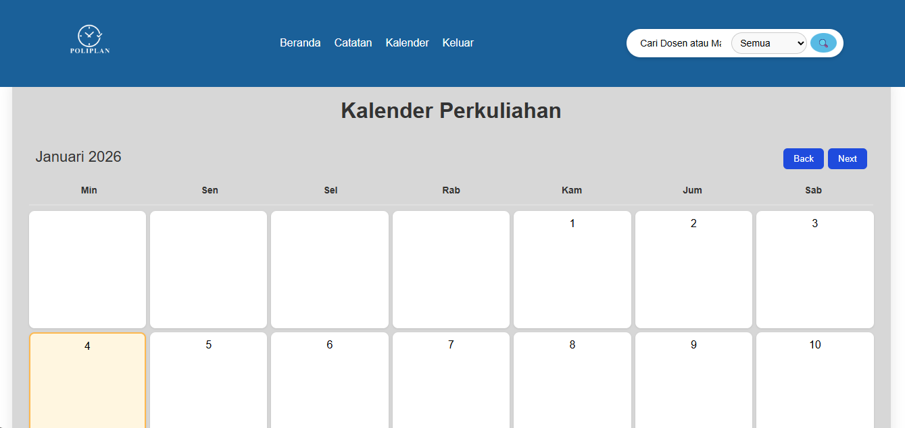
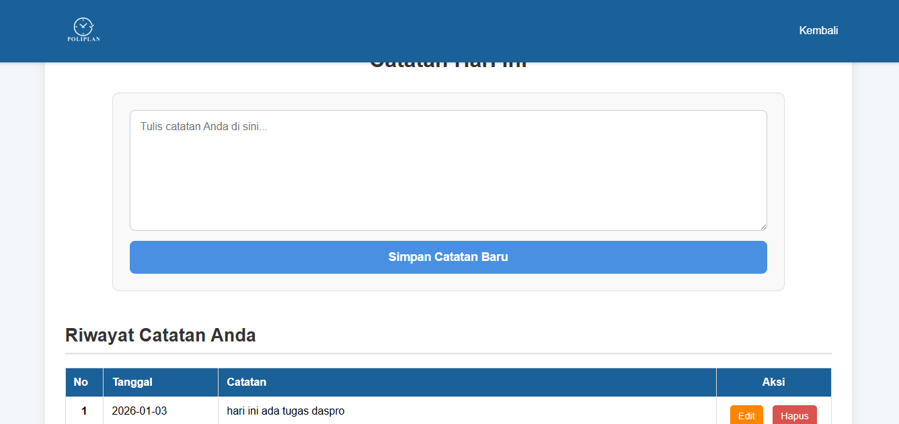
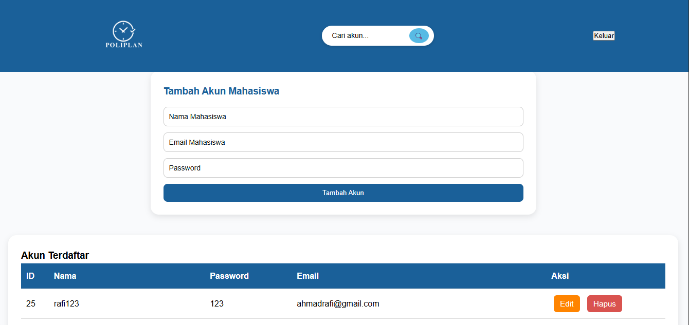

POlIPLAN

Poliplan adalah sebuah website yang revolusioner untuk mahasiswa. Visi kami untuk Poliplan itu sangat banyak, tetapi utamanya kami ingin poliplan berguna untuk para mahasiswa dalam manajemen waktu mereka supaya mereka tidak kewalahan dengan seluruh matakuliah mereka.

Poliplan mempunyai berbagai fitur yang dapat membantu mempermudah manajemen waktu mahasiswa, seperti:
1. Kalender interaktif yang dapat menyetor mata kuliah yang ditambah secara manual oleh mahasiswa dengan opsi pengulangan sebuah matakuliah untuk tiga bulan kedepan.
2. Dua box yang menampilkan jadwal pada minggu terkini dan mata kuliah pada hari itu juga.
3. Search dan filter supaya mempermudah mencari matakuliah yang telah di setel oleh mahasiswa.
4. Halaman catatan supaya lebih mudah mengingat tugas, instruksi dari manpro, dan lain-lain

Dokumentasi web kami:

